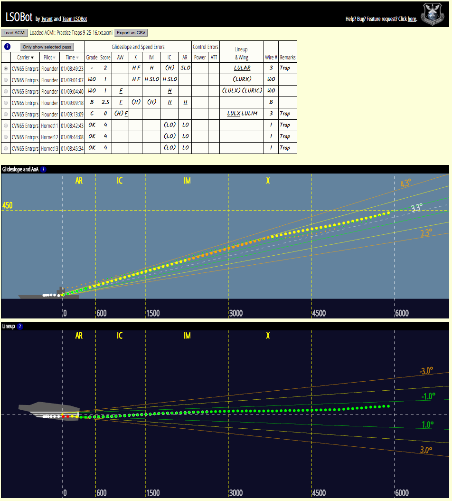

# LSOBot
A carrier landing grading tool for Falcon BMS.

# How to Install
It's a web app - there's nothing to install. Just visit https://candera.github.io/lsobot.

# How to Use
Check out the [official announcement thread](https://www.bmsforum.org/forum/showthread.php?28908-Release-LSOBot-A-Carrier-Landing-Grading-Tool),
or the [tutorial video](https://www.youtube.com/watch?v=tSepFhml2DY).

